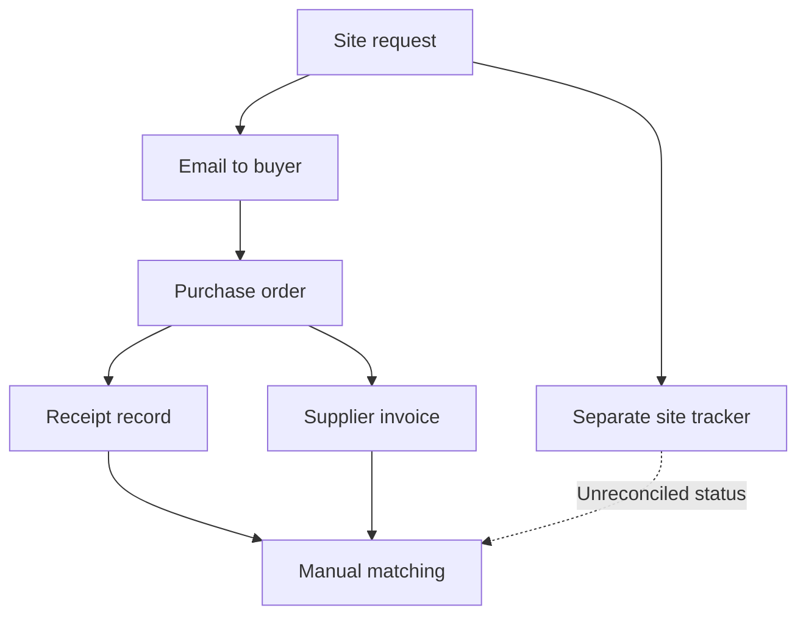
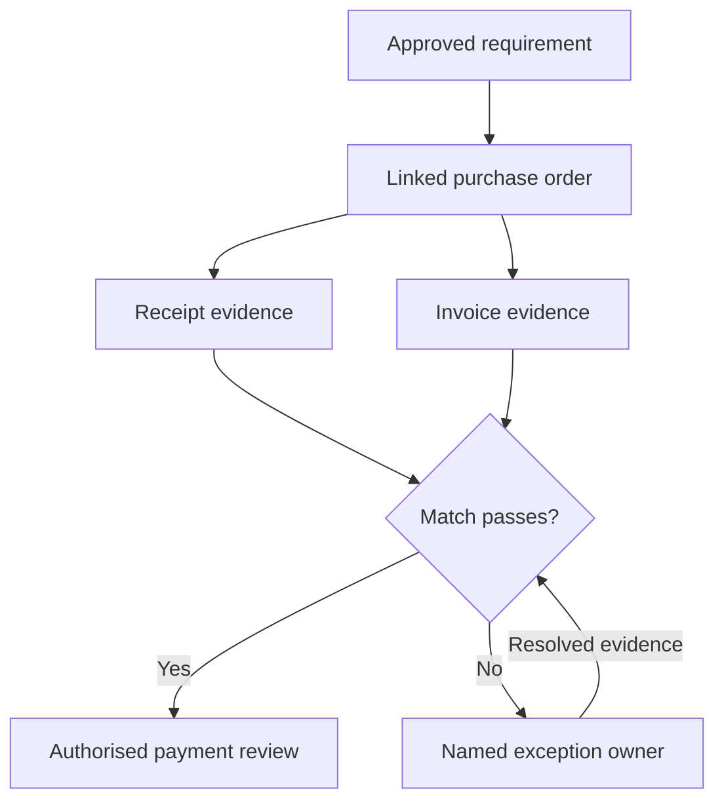

# How I approached the ERP process design

**Fictional business-analysis case · read in about five minutes**

## 1. Start with the decision and the people

The design question is: how can a project manager, buyer, storekeeper and finance controller
agree on one traceable status from request to payment? The target is fewer unexplained
handoffs and reconcilable information, not a predetermined software feature list.

I would validate these hypotheses with process owners in a real discovery exercise. No
client interviews or observations are claimed in this fictional case.

| Stakeholder | Question to investigate | Design consequence |
|---|---|---|
| Site engineer | What must arrive, where and by when? | Resource, quantity, project and required-by are explicit |
| Buyer | Is the requirement approved and already ordered? | Requisition-to-order reference and duplicate review |
| Storekeeper | Which order and line does a receipt fulfil? | Distinct receipt events and order linkage |
| AP analyst | Does the invoice match goods and agreed rates? | Match exception and accountable resolver |
| Finance controller | Who authorised this liability and payment? | Segregated approvals and reconciliation evidence |

## 2. Make the hypothetical AS-IS problem visible

The problem is not that email always fails. It is that the proposed scenario has duplicate
status records and no clear reconciliation owner. I prioritise identifiers, status meaning
and ownership before dashboards or prediction.

## 3. Design the TO-BE controls at the handoffs

This diagram specifies desired behaviour. The repository does not configure or enforce an
actual ERP approval engine. The executable slice is data validation and reporting.

## 4. Compare alternatives and record the trade-off

| Decision | Alternative considered | Selected approach and reason |
|---|---|---|
| Status visibility | Maintain another manually updated tracker | Derive status from linked events, retaining an explicit extract cutoff |
| Report grain | Join all receipt/payment details directly | Aggregate each child grain first to avoid inflated commitments |
| Bad records | Automatically “clean” ambiguous values | Flag and route to an owner; preserve original evidence |
| Release scope | Deploy all modules in one cutover | Pilot the connected procurement/AP slice with reconciliation gates |

## 5. Follow one requirement into evidence

**REQ-04:** payment instalments must not duplicate invoice or order totals.

Fictional example: an order of INR 100,000 has two receipts and an invoice paid in two
instalments. A raw detail join may repeat the same order multiple times. I require one row
per order in the management report, with child payments aggregated before joining.

- Business rule: report totals reconcile to unique source records.
- Acceptance: multiple receipt/payment rows do not change the original order value.
- Implementation: [`CONTROL_TOWER_SQL`](../../aec/analytics.py).
- Executed evidence: [notebook section on join inflation](../../notebooks/03_procure_to_pay.ipynb).
- Automated check: `test_sql_no_join_inflation` in [tests](../../tests/test_portfolio.py).

This establishes the requirement-to-test link. It does not prove that a real business has
adopted the process or achieved a measured improvement.

## 6. Decide whether the design is ready for implementation

Entry to UAT requires approved role definitions, mapped data, agreed exception ownership
and reconciled trial extracts. Go-live requires critical scenarios passed, no critical unresolved
defects, business sign-off and a rollback plan. These gates are specified in the
[delivery and UAT pack](../../docs/BUSINESS_DELIVERABLES.md).

**What I would measure:** cycle time, unmatched invoice balance, exception age and reconciliation
differences, with consistent pre/post scope. No invented improvement percentages are included.

**Interview discussion:** Which requirement would you validate first? When is a missing GRN
a valid open state? Why should process ownership precede machine learning?

[Back to case study](README.md) · [All projects](../../README.md)
