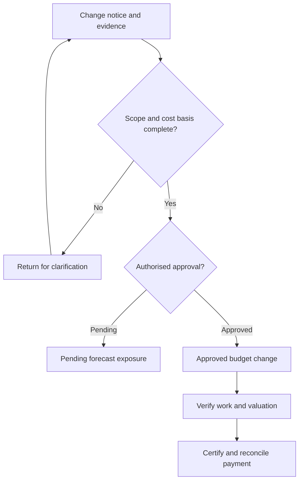
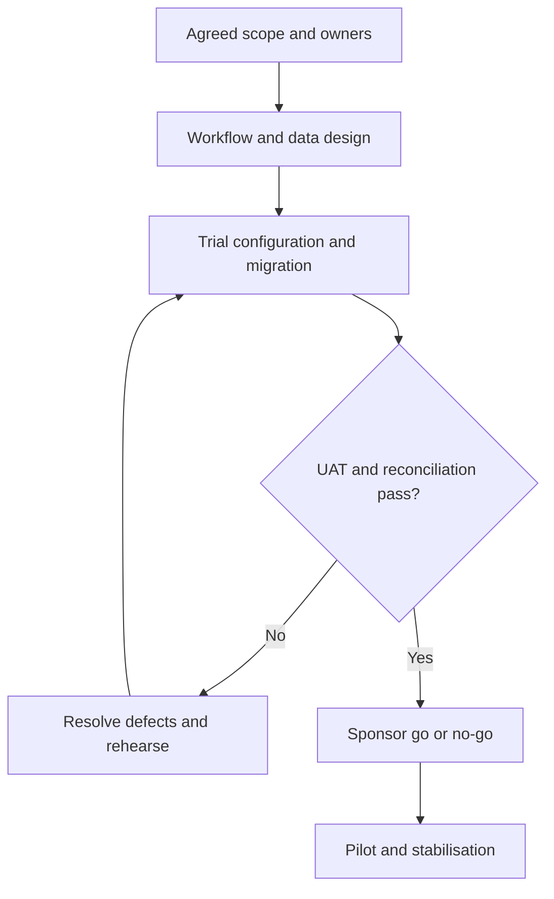

# How I approached variation and payment governance

**Fictional commercial-governance and delivery case · read in about five minutes**

## 1. Define the decision boundary

The question is how a change moves from a site instruction to an authorised commercial
position and a reconciled payment. A change being recorded is not the same as approval,
certification or entitlement. I keep those decisions separate.

No actual contract is interpreted here. Contract notice deadlines and delegated monetary
limits must come from authorised project documents and the organisation's policies.

## 2. Map decisions and exception paths

Pending exposure can influence a scenario forecast without becoming approved budget. That
distinction makes commercial reporting more useful while preserving authority boundaries.

## 3. Trace a fictional change through the controls

| Step | V-DEMO-01: revised MEP routing | Evidence or decision |
|---|---|---|
| Notice | Engineer records the instruction and scope | Reference, date, issuer and affected package |
| Evaluation | Quantity surveyor estimates INR 180,000 | Quantity/rate basis and time-impact assumptions |
| Pending | Forecast exposure remains visible | Excluded from approved budget until authorised |
| Approval | Delegated approver signs the change | Decision, authority and audit record |
| Valuation | 60% of eligible work is independently verified | INR 108,000 base value before contract-specific adjustments |
| Payment review | Finance checks prior certificates and deductions | Reconciled amount; unresolved items held for review |

The numbers are an authored example. There is no inference of legal entitlement or an
actual certificate. Retention, taxes and previous certification require separate inputs.

## 4. Explain the trade-offs

| Design choice | Reason | Remaining risk |
|---|---|---|
| Separate pending and approved values | Exposes uncertainty without bypassing approval | Stale status if owners do not review |
| Preserve rejected changes | Maintains a decision trail | Access and retention rules still need implementation |
| Human review of model flags | Predictions cannot establish contractual entitlement | Reviewer workload and consistency |
| Phased release | Test workflow and reconciliations with a small cohort | Parallel processes need a defined closure date |

## 5. Plan delivery and acceptance

The [delivery pack](../../docs/BUSINESS_DELIVERABLES.md) specifies phase deliverables, dependencies,
RAID items, role responsibilities and rollback triggers. Indicative durations are planning
assumptions, not evidence that a client implementation took that time.

## 6. Show what would block release

- A pending variation updates approved budget without an approval record.
- A certifier can repeatedly value the same verified work without a cumulative check.
- A payment preparer can release the same transaction without segregation.
- Trial extract totals fail reconciliation and differences have no accepted explanation.
- Users do not know who owns exceptions after cutover.

These are design/UAT specifications. The repository supplies synthetic variation records
and scenario models; it does not implement these controls inside an ERP product.

**What I would measure:** notice-to-decision time, age/value of pending exposure, unresolved
certification differences and reconciliation exceptions. No prevented disputes or savings are claimed.

**Interview discussion:** When can a pending change enter a forecast? Who owns the go/no-go
decision? How do you separate technical test completion from business acceptance?

[Back to case study](README.md) · [All projects](../../README.md)
