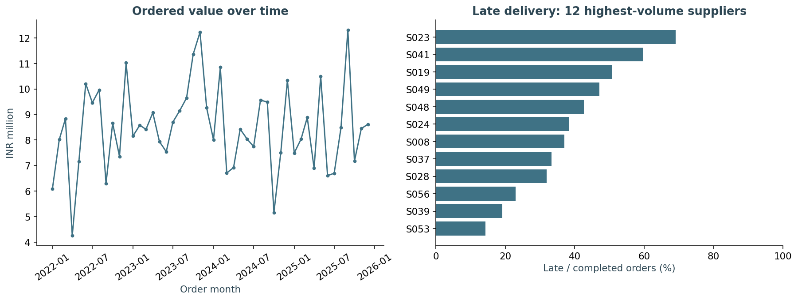

# Procure-to-Pay & Supplier Performance Control Tower

[View the executed notebook](../../notebooks/03_procure_to_pay.ipynb) · [Browse source code](../../aec/)

Read the saved charts and reasoning on GitHub, or run a copy in Colab. No client data is used.

**Data Analysis · SQL · reconciliation · exception reporting**

## Decision and users

Buyers, project managers and AP analysts need to locate unfulfilled orders, late deliveries,
rejections and overdue invoice balances. This report joins operational events without
inflating financial totals.

## Data and workflow

Synthetic requisition → order → one/many GRNs → invoice → one/many payment instalments.
The schema simplifies each order to one line; enquiry comparison, tax, retention and credit
notes are excluded. Currency is INR throughout. Export cutoff: 2025-12-31.

## KPI contract

| KPI | Definition / denominator |
|---|---|
| Ordered value | Sum unique order-line amounts |
| Completed delivery | Cumulative gross receipt quantity ≥ order quantity |
| On-time delivery | Completed orders received by required-by / all completed orders |
| Overdue open orders | Incomplete orders whose required-by is before export cutoff |
| Rejection quantity rate | Rejected quantity / gross received quantity |
| Overdue invoice balance | Positive invoice less payments, where due date precedes cutoff |
| Uninvoiced commitment | Positive order amount less linked invoice amounts |

Completed-order performance excludes open orders; show overdue-open count alongside it
to expose survivorship bias. Gross delivery completion is not accepted-material completion.
Rejection rate is quantity-weighted across this simplified dataset; production reporting must
not aggregate incompatible units as though quantities were comparable.

## Implementation

`aec/analytics.py::CONTROL_TOWER_SQL` first aggregates receipts and invoice instalments,
then joins one row per order. Tests reconcile total orders, invoices and payments to sources.
The damaged fixture is analysed separately and cannot contaminate the clean dashboard.

Run `python -m aec.run` then `python -m aec.dashboard`. Open the generated
`outputs/control_tower.html` for supplier filtering and KPI totals. This is a local report,
not a live ERP dashboard or a Power BI deliverable.

## Actual evidence

- [Computed KPIs](../../outputs/control_tower.json)
- [Supplier scorecard](../../outputs/supplier_scorecard.json)
- [Data-quality findings](../../outputs/reconciliation_findings.json)
- [SQL and calculation code](../../aec/analytics.py)
- [Tests](../../tests/test_portfolio.py)

## Business use and limitations

Prioritise late-open order follow-up and overdue invoice review. A missing downstream event
can reflect legitimate open work, cancellation or extract timing; it is not automatically fraud
or a process failure. No client efficiency gain or savings is claimed.

[Back to portfolio](../../README.md)
